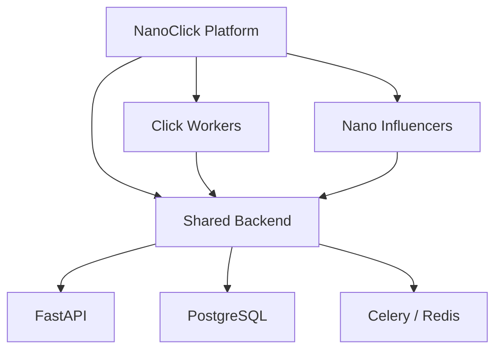

<div align="center">

# 📲 NanoClick Platform

### A shared infrastructure layer for task workers and nano-influencer campaigns.

<p>


</p>

**One backend. Two product surfaces. One shared platform direction.**

</div>

---

## 🧭 Platform overview

NanoClick is a monorepo containing a shared backend and two client applications:

<table>
<tr><td width="50%" align="center">

### 👷 Click Workers
Workers discover and complete tasks, track activity, and manage earnings.

</td><td width="50%" align="center">

### 📣 Nano Influencers
Advertisers create campaigns and manage influencer-oriented activity.

</td></tr>
</table>

## 🏗️ Monorepo architecture



<details open>
<summary><strong>📁 Repository map</strong></summary>

```text
backend/           FastAPI + SQLAlchemy + PostgreSQL + Celery/Redis
click-workers/     Flutter web application
nano-influencers/  React / Vite application
docs/              architecture and migration documentation
```

</details>

## 📌 Baseline status

This repository is the initial baseline import of three existing projects. It intentionally began as an as-is import before migration and cleanup work.

The current direction includes removing Firebase dependencies from the worker application and completing the advertiser-facing application against the shared backend.

<details>
<summary><strong>🔐 Security note</strong></summary>

A previous import source contained live-looking payment secrets in a temporary asset file. That file was deliberately excluded. Secrets belong server-side and must never be committed into a client application.

</details>

## 🛠️ Working conventions

- Feature work happens on branches off `main`.
- Pull requests are used for changes.
- Each application can be developed independently while sharing the backend contract.
- Generated files and environment secrets stay out of source control.

## 🚧 Development direction

The immediate priority is to establish a clean shared backend contract, remove legacy platform coupling, and then complete the individual product surfaces against that contract.

## 🔐 Ownership

This repository contains proprietary platform software and documentation. See [`LICENSE`](./LICENSE) for usage terms.
